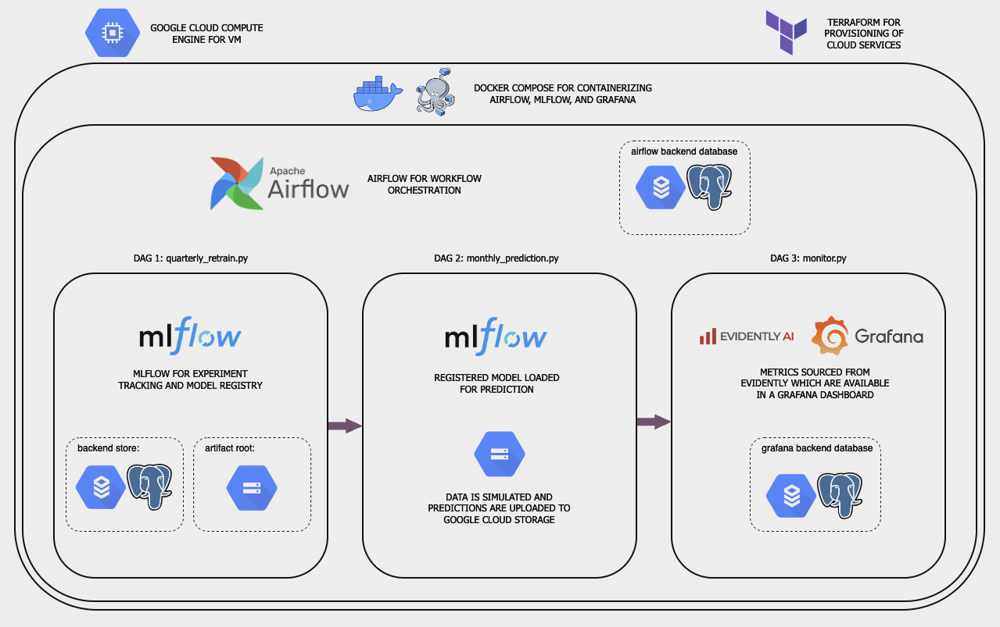

# Customer Churn Prediction

## Overview

This project was completed for the [MLOps Zoomcamp Course](https://github.com/DataTalksClub/mlops-zoomcamp/tree/main). The main goal was to create a complete MLOps workflow that includes experiment tracking and model registry, monitoring, workflow orchestration, containerized deployment on the cloud in a virtual machine (VM), and provisioning of infrastructure through IaC (infrastructure as code).



## Problem Description

Customer churn is a large part of every company as retaining existing customers is crucial for maintaining revenue and growth. It's essential to understand what leads a customer to leave and what preventative measures we can put in place. The goal is to train a classification model using various metrics to predict whether a customer is likely to leave. 

## Dataset

- The dataset is collected from [Kaggle](https://www.kaggle.com/datasets/shilongzhuang/telecom-customer-churn-by-maven-analytics?resource=download)


## Technologies used

- Terraform: infrastructure as code (IaC)
- GCP: cloud infrastructure (VPC, VM, SQL, GCS)
- MLFlow: experiment tracking and model registry
- Airflow: orchestration
- Docker: deployment
- Grafana/Evidently AI: model and data monitoring

## Pre-requesites

- download docker, make ```brew install make```
- setup GCP

### Setting up the GCP environment:

1. sign up for GCP and create a project
2. install [Google Cloud CLI](https://cloud.google.com/sdk/docs/install-sdk) and configure
3. create service account with owner and editor roles and create json key
4. open command shell and insert the following prompts: 

    ```shell
    gcloud config set project <INSERT_PROJECT_NAME>
    ```
    - Configures the CLI to the project


    ```shell
    gcloud iam service-accounts create gcp-terraform --display-name "Terraform service account" 
    ```

    - Creates a service account to allow terraform to provision resources


    ```shell
    gcloud projects add-iam-policy-binding <INSERT_PROJECT_NAME> --member="serviceAccount:gcp-terraform@<INSERT_PROJECT_NAME>.iam.gserviceaccount.com" --role="roles/owner"
    ```

       - Configures the service account role to owner


    ```shell
    gcloud iam service-accounts keys create ~/terraform-key.json --iam-account=gcp-terraform@<INSERT_PROJECT_NAME>.iam.gserviceaccount.com
    ```

        - Creates json key


    ```shell
    export GOOGLE_APPLICATION_CREDENTIALS='/path/to/credentials.json'
    ```

    - Sets environmental variable in terminal to allow credentials to be used


### Installation: Deploying with Docker on the GCP VM

1. Open a terminal where you would like to clone this repository and run:

    ```shell
    git clone https://github.com/bradentam/Customer-Churn-Prediction.git
    ```

1. In the terraform folder, configure the `variable.tf` file with your own specifications.

2. To build the GCP resources and deploy docker-compose on the VM, go to the root of the directory and run:

```shell
make build-resources
```

    This command will do the following:
    - Apply terraform code
        - `terraform init`: Initializes the terraform files
        - `terraform apply`: Creates all the resources required for this project (VPC, VM, SQL database, GCS)
        - The terraform code will also produce a `.env` file which will be used by the docker-compose.yaml and other files to read in environmental variables to properly configure the connections to the cloud resources.
    - Copy required files to the VM and build the docker-compose file.

3. Download and upload the `telecom_customer_churn.csv` file to your GCS `data_bucket` specified in `variable.tf`.

4. After the VM is created, you can view the Airflow, MLflow, and Grafana UIs by entering the following in your web browser.  

| Service | URL                | 
|---------|--------------------|
| Airflow | <EXTERNAL_IP>:8081 | 
| MLflow  | <EXTERNAL_IP>:5000 | 
| Grafana | <EXTERNAL_IP>:3000 | 

The external IP address can be found by using the following command:
```shell
gcloud compute instances list
```

After following these steps, you should have everything deployed on the cloud!

The DAGs can be turned on in the UI.


After running the `quarterly_retrain.py` DAG, you'll be able to view the experiments and registered models in MLflow.
  


After running the `monthly_prediction.py` and `monitor.py` DAGs, the monitoring metrics can be viewed in the Grafana dashboard.

