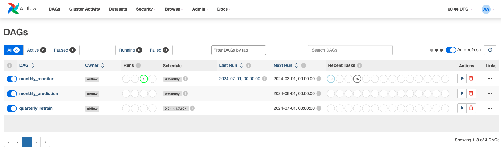

# Customer Churn Prediction

## Overview

This project was completed for the [MLOps Zoomcamp Course](https://github.com/DataTalksClub/mlops-zoomcamp/tree/main). The main goal was to create a complete MLOps workflow that includes experiment tracking and model registry, monitoring, workflow orchestration,containerized deployment on the cloud, provisioning of infrastructure through IaC (infrastructure as code).

- infrastructure visual

## Problem Description

Customer churn is a large part of every company as retaining existing customers is crucial for maintaining revenue and growth. It's essential to understand what leads a customer to leave and what preventative measures we can put in place. The goal is to train a classification model using various metrics to predict whether a customer is likely to leave. 

## Dataset

- The dataset is collected from [Kaggle](https://www.kaggle.com/datasets/shilongzhuang/telecom-customer-churn-by-maven-analytics?resource=download)


## Technologies used

- Terraform: infrastructure as code (IaC)
- GCP: cloud infrastructure (VM, SQL, storage)
- MLFlow: experiment tracking and model registry
- Airflow: orchestration
- Docker: deployment
- Grafana/Evidently AI (model monitoring)

### Setting up the GCP environment

- sign up for GCP and create a project
- install [Google Cloud CLI](https://cloud.google.com/sdk/docs/install-sdk) and configure
- create service account with owner and editor roles and create json key

- open command shell and insert the following prompts: 

Configures the CLI to the project: 
- ```gcloud config set project <INSERT_PROJECT_NAME>```

Creates a service account: 
- ```gcloud iam service-accounts create gcp-terraform --display-name "Terraform service account" ```

Configures the service account role to owner: 
- ```gcloud projects add-iam-policy-binding <INSERT_PROJECT_NAME> --member="serviceAccount:gcp-terraform@<INSERT_PROJECT_NAME>.iam.gserviceaccount.com" --role="roles/owner"```

Creates json key: 
- ```gcloud iam service-accounts keys create ~/terraform-key.json --iam-account=gcp-terraform@<INSERT_PROJECT_NAME>.iam.gserviceaccount.com```

Sets environmental variable in terminal to allow credentials to be used: 
- ```export GOOGLE_APPLICATION_CREDENTIALS='/path/to/credentials.json'```

### Terraform

- Configure the variable.tf file with your own specifications
- Run ```terraform init```: Initializes the terraform files
- Run ```terraform apply```: Creates all the resources required for this project (VPC, VM, SQL database, GCS)
- After several minutes, you should see resources in your [google cloud console](console.cloud.google.com) start to appear. The SQL database instance will take the longest to spin up. 

### Updating file configurations

**docker-compose.yaml:**
- update lines 10 and 11 to add connection to GCP postgres DB instance.

**Dockerfile.mlflow:**
- update lines 8 and 11 to add connection to GCP postgres DB instance and GCS bucket. 

**grafana_datasources.yaml:**
- update lines 10, 12, and 14 to add connection to GCP postgres DB.

### Deploying with Docker on the GCP VM

After the virtual machine is created, we'll need to copy the required files to the virtual machine with the following prompt:
```gcloud compute scp --recurse /Users/bradentam/Documents/projects/Customer-Churn-Prediction/docker-compose.yaml  mlops-server:~ --zone us-west1-a```

Once the files are on the VM, we can SSH into the VM and run the following to download docker inside the VM:

```
sudo apt update
sudo apt install docker.io
sudo systemctl start docker
sudo systemctl enable docker
sudo curl -L "https://github.com/docker/compose/releases/download/v2.15.0/docker-compose-$(uname -s)-$(uname -m)" -o /usr/local/bin/docker-compose
sudo chmod +x /usr/local/bin/docker-compose
```

The following commands will apply to both deployment locally and on the VM:

Set airflow_uid in environmental file:
- ```echo -e "AIRFLOW_UID=$(id -u)" > .env```

Initialize airflow db:
- ```docker-compose up airflow-init```

Build the docker images:
- ```docker-compose build```

Run the docker compose file:
- ```docker-compose up```

### Airflow
- access Airflow UI by entering "<EXTERNAL_IP_ADDRESS_VM>:8080" into your web browser
- the external IP address can be found by using the following command
```gcloud compute instances list```


### MLflow
- access MLflow UI by entering "<EXTERNAL_IP_ADDRESS_VM>:5000" into your web browser
- The experiments can be tracked here with data regarding the tracked metrics and models.

  


### Monitoring
- access Grafana dashboard by entering "<EXTERNAL_IP_ADDRESS_VM>:3000" into your web browser


### Running locally

If you would like to run the project locally, you can skip setting up GCP and terraform. You'll still need to configure the docker-compose.yaml, Docker.mlflow, grafana_datasources.yaml files.

